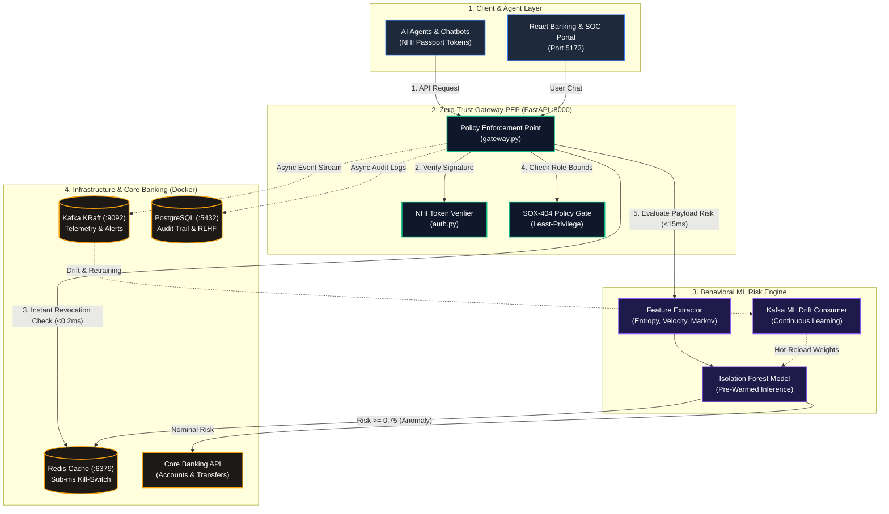

# Zero-Trust Non-Human Identity (NHI) Access Governor — Architecture

## High-Level System Architecture

---

## Architecture Summary (Executive / Presentation)

| Layer                                | Primary Role                                                                                                            | Key Technology & Files                                                                                     |
| :----------------------------------- | :---------------------------------------------------------------------------------------------------------------------- | :--------------------------------------------------------------------------------------------------------- |
| **1. Client & Agent Layer**          | Autonomous AI agents & banking user interfaces presenting cryptographic tokens.                                         | HMAC-SHA256 Passports, React (`frontend/src/App.jsx`)                                                      |
| **2. Zero-Trust Gateway PEP**        | Sub-millisecond policy enforcement, cryptographic signature verification, deterministic SOX-404 least-privilege checks. | FastAPI (`backend/pep/gateway.py`), Auth Manager (`backend/core/auth.py`)                                  |
| **3. Behavioral ML Risk Engine**     | Real-time payload anomaly detection (Shannon entropy, request velocity, Markov transitions) via Isolation Forest.       | Scikit-Learn (`backend/ml/risk_engine.py`), Drift Consumer (`backend/ml/kafka_consumer.py`)                |
| **4. Core Banking & Data Backplane** | Atomic banking mutations, sub-millisecond quarantine cache, enterprise compliance audit trail, and streaming telemetry. | PostgreSQL (`:5432`), Redis (`:6379`), Kafka KRaft (`:9092`), Mock Banking (`backend/api/mock_banking.py`) |

---

## Key Performance SLAs (Deloitte BFSI Rubric)

- **Fast-Path Gateway PEP Overhead**: `< 2.0 ms` (Target: `< 5.0 ms`)
- **Kill-Switch Revocation Lookup**: `< 0.2 ms` (Target: `< 1.0 ms`)
- **Full ML Behavioral Scoring**: `12 - 15 ms` (Target: `< 30.0 ms`)
- **Quarantine MTTR (Mean-Time-To-Remediate)**: `~20 ms` (Target: `< 200.0 ms`)
- **Telemetry & Audit Logging Impact**: `0.0 ms` overhead (fully non-blocking thread and Kafka dispatch)
