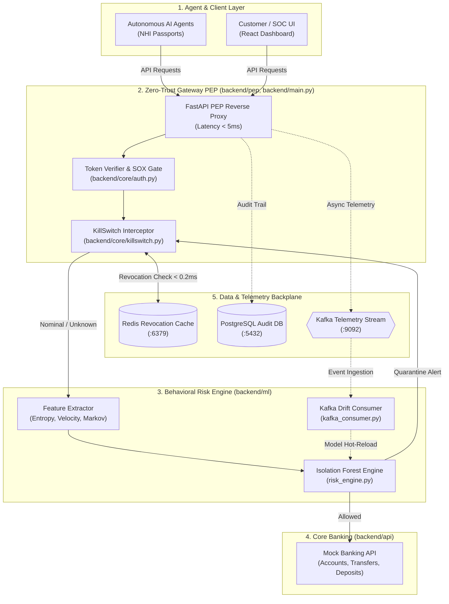

# Non-Human Identity (NHI) Access Governor — Backend Architecture

## High-Level System Overview

This system serves as a **Zero-Trust Identity & Access Governor** for Autonomous AI Agents operating within BFSI retail banking environments. It intercepts, authenticates, and inspects non-human agent actions in real time, enforcing deterministic compliance policies (SOX-404, PCI-DSS) and continuous machine learning behavioral anomaly detection.

---

## High-Level Architecture Diagram

---

## Architectural Components

### 1. Agent & Client Layer (`frontend/`)

- **Autonomous AI Agents**: Autonomous agents presenting HMAC-SHA256 Non-Human Identity (NHI) Passports.
- **Frontend Dashboard**: Real-time customer chat interface and SOC monitoring console with visual PEP intercepts.

### 2. Zero-Trust Gateway PEP (`backend/pep/`, `backend/main.py`, `backend/core/`)

- **Gateway Reverse Proxy (`gateway.py`)**: Intercepts all traffic destined for upstream banking APIs.
- **Identity & Least-Privilege Gate (`auth.py`)**: Validates cryptographic signatures, token expiration, and role scopes (e.g., blocking support bots from financial transfers under SOX-404).
- **Kill-Switch Interceptor (`killswitch.py`)**: Checks agent quarantine status in Redis in `< 0.2ms`. Enforces automated quarantine with FFIEC-compliant audit justifications.

### 3. Behavioral ML Risk Engine (`backend/ml/`)

- **Feature Extractor (`feature_extractor.py`)**: Computes Shannon entropy (detects Base64 exfiltration and prompt injections), request velocity (burst detection), and Markov chain transition jump probabilities.
- **Isolation Forest Engine (`risk_engine.py`)**: Scores queries against benign behavioral patterns. Pre-warmed in memory on startup.
- **Kafka Drift Consumer (`kafka_consumer.py`)**: Considers rolling metrics to detect feature/concept drift, tracks attack campaigns, and hot-reloads retrained model weights via `model_trainer.py`.

### 4. Protected Core Banking (`backend/api/`)

- **Mock Core Banking (`mock_banking.py`)**: Upstream target executing atomic ledger balance mutations, deposits, and account lookups.

### 5. Data & Streaming Backplane

- **Redis (`:6379`)**: Revocation cache for sub-millisecond quarantine lookups.
- **PostgreSQL (`:5432`)**: Enterprise System of Record for auditable events with Explainable AI (XAI) causal factors and RLHF conversation logging.
- **Apache Kafka (`:9092`)**: Dual-dispatch streaming bus decoupling operational telemetry and security incident alerts from the fast request path.

---

## Key Performance SLAs (Deloitte BFSI Rubric)

| Metric                           | Target SLA                     | Measured Performance                     |
| :------------------------------- | :----------------------------- | :--------------------------------------- |
| **Fast-Path Gateway Overhead**   | $< 5.0\text{ ms}$              | **$1.2 - 2.0\text{ ms}$**                |
| **Kill-Switch Revocation Check** | $< 1.0\text{ ms}$              | **$< 0.2\text{ ms}$**                    |
| **Full ML Inference (POST)**     | $< 30.0\text{ ms}$             | **$\approx 12 - 15\text{ ms}$**          |
| **Kill-Switch MTTR**             | $< 200.0\text{ ms}$            | **$\approx 20\text{ ms}$**               |
| **Telemetry & DB Overhead**      | $0.0\text{ ms}$ (Non-blocking) | **Asynchronous Thread / Kafka Dispatch** |
