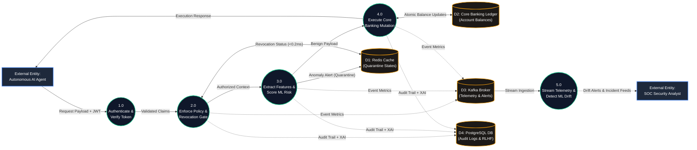

# Zero-Trust Gateway PEP — Data Flow Diagram (DFD)

## High-Level Data Flow Diagram (Level 1 DFD)

---

## Data Transformation Pipeline

| Stage | Process | Inputs | Outputs / Side Effects | Destination Store |
| :---: | :--- | :--- | :--- | :--- |
| **1.0** | **Authentication** | Bearer Passport (HMAC-SHA256) | Validated Agent Claims (`agent_id`, `role`) | In-Memory Context |
| **2.0** | **Revocation & Policy** | Validated Claims + HTTP Path | Access Allowed vs. `403 Forbidden` | `D1: Redis Cache` (Lookup `< 0.2ms`) |
| **3.0** | **Behavioral ML Scoring** | Raw Payload & Endpoint | Risk Score ($0.0 - 1.0$), XAI Causal Factors | `D1: Redis Cache` (Auto-Quarantine if $\ge 0.75$) |
| **4.0** | **Banking Ledger Update** | Authorized Banking Request | New Balances (`source`, `dest`) & 200 OK | `D2: Banking Ledger` (`banking_accounts`) |
| **5.0** | **Telemetry & Drift Engine** | Dual-Dispatched Event Stream | Continuous Drift Alarms & Retraining Buffer | `D3: Kafka Broker` & `D4: PostgreSQL` |

---

## Data Stores Summary

- **D1: Redis Cache (`:6379`)**: High-performance key-value store holding active quarantine keys (`agentic_iam:revoked:agent:<id>`) with automated TTLs.
- **D2: Core Banking Ledger (`banking_accounts`)**: Relational ACID storage for customer deposits, current accounts, and ledger balance adjustments.
- **D3: Kafka Telemetry Broker (`:9092`)**: High-throughput distributed streaming topics (`agentic-iam.telemetry` and `agentic-iam.alerts`).
- **D4: PostgreSQL Compliance DB (`:5432`)**: Persistent System of Record housing `audit_logs` (tamper-evident XAI decision trail) and `conversations` (RLHF dataset).

