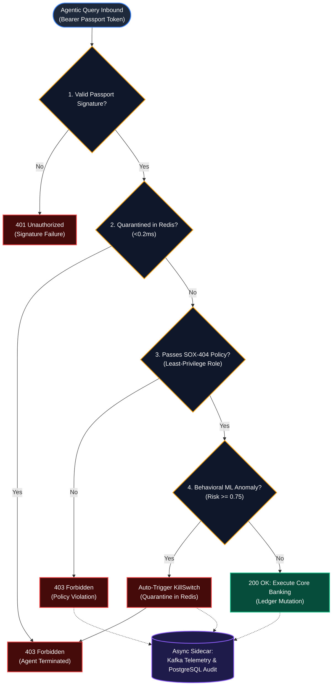

# Zero-Trust Gateway PEP — Request Lifecycle & Decision Flowchart

## Operational Decision Flowchart

---

## Gate Evaluation Summary

| Step | Security Gate | Mechanism & Target SLA | Result on Failure |
| :---: | :--- | :--- | :--- |
| **1** | **Cryptographic Identity** | HMAC-SHA256 Bearer Passport signature check (`< 0.5 ms`) | `401 Unauthorized` |
| **2** | **Revocation Check** | Sub-millisecond Redis key lookup `agentic_iam:revoked:agent:<id>` (`< 0.2 ms`) | `403 Forbidden (Agent Terminated)` |
| **3** | **SOX-404 Compliance** | Deterministic role gate (e.g. support agents blocked from transfers) (`< 0.5 ms`) | `403 Forbidden (Policy Violation)` |
| **4** | **Behavioral ML Engine** | Isolation Forest inference scoring entropy, velocity, & Markov transitions (`< 15 ms`) | Auto-Quarantine in Redis + `403 Forbidden` |
| **5** | **Execution & Audit** | Atomic banking balance updates + non-blocking Kafka/Postgres telemetry (`0.0 ms` overhead) | `200 OK (Allowed)` |
