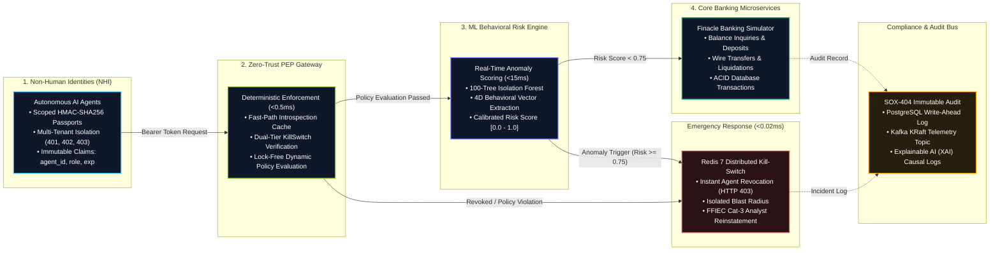

# Apex Commercial Bank: Zero-Trust Agentic-AI Behavioral Governor & PEP Gateway

[](docs/PRESENTATION.md)
[](https://python.org)
[](https://fastapi.tiangolo.com)
[](https://react.dev)
[](docker-compose.yml)
[](tests/)
[](docs/ARCHITECTURE.md)

> **High-Performance In-Line Security Gateway, Unsupervised ML Behavioral Anomaly Detection, and FFIEC Cat-3 Distributed Revocation for Non-Human Identities (NHI) in Core Banking Infrastructure.**

---

## Table of Contents
1. [Executive Summary & Problem Statement](#1-executive-summary--problem-statement)
2. [End-to-End System Architecture (The 4 Stages)](#2-end-to-end-system-architecture-the-4-stages)
3. [Core Technical Innovations](#3-core-technical-innovations)
   - [A. Sub-Millisecond PEP Gateway & Negative Caching](#a-sub-millisecond-pep-gateway--negative-caching)
   - [B. Multi-Tier Distributed Kill-Switch (FFIEC Cat-3)](#b-multi-tier-distributed-kill-switch-ffiec-cat-3)
   - [C. Dynamic Dual-Plane Policy Engine](#c-dynamic-dual-plane-policy-engine)
   - [D. Multi-Dimensional ML Behavioral Risk Engine](#d-multi-dimensional-ml-behavioral-risk-engine)
4. [Enterprise Repository Layout](#4-enterprise-repository-layout)
5. [Empirical Benchmarks & Performance SLAs](#5-empirical-benchmarks--performance-slas)
6. [Quick Start & Installation Guide](#6-quick-start--installation-guide)
7. [Comprehensive Automated Test Suite](#7-comprehensive-automated-test-suite)
8. [Multi-Tenant Personas & Credentials](#8-multi-tenant-personas--credentials)
9. [Core API Reference](#9-core-api-reference)
10. [Regulatory Compliance & Industry Alignment](#10-regulatory-compliance--industry-alignment)
11. [Project Attribution & Engineering Team](#11-project-attribution--engineering-team)

---

## 1. Executive Summary & Problem Statement

Autonomous Agentic AI assistants are rapidly being integrated into Tier-1 commercial banking systems to handle conversational customer care, wire transfer initiation, fixed deposit (FD) management, and portfolio advisory. These autonomous agents act with **Non-Human Identity (NHI)** bearer credentials and high-level database execution privileges.

### The Threat Landscape
Traditional enterprise security perimeters and Web Application Firewalls (WAFs) fail to protect against agentic attacks:
- **Blind to Semantic Intent**: WAFs inspect layer-7 HTTP payloads for SQL injection (SQLi) or cross-site scripting (XSS) syntax. They cannot detect prompt injection attacks, semantic jailbreaks, or tool-calling privilege escalation.
- **Workflow State Jumps (Illegal Markov Transitions)**: An agent that performs an initial handshake and immediately attempts to trigger a wire transfer or database dump without passing required KYC or balance inquiries violates the principle of least privilege.
- **Data Exfiltration via High Information Entropy**: Adversaries often leverage base64-encoded strings or steganographic payloads to exfiltrate customer PII and transaction histories.
- **Cascading Blast Radius**: In multi-tenant environments, a rogue or compromised agent operating on behalf of Customer A must never be able to access, modify, or liquidate assets belonging to Customer B.

### The Solution: Apex Zero-Trust Governor
The **Apex Zero-Trust Access Governor** functions as a high-speed, sub-millisecond **Policy Enforcement Point (PEP)** reverse proxy. It sits directly in-line between conversational AI agents and Core Banking Microservices (Finacle Simulator), inspecting 100% of API requests against:
1. **Cryptographic Identity Verification** (HMAC-SHA256 Agent Passports with pre-validated introspection caching).
2. **Distributed Kill-Switch Verification** (sub-0.02ms L1-cached revocation checks).
3. **Deterministic Least-Privilege Policies** (lock-free in-memory evaluation with pre-compiled wildcard matching).
4. **Behavioral ML Anomaly Scoring** (Isolation Forest scoring 4D vectors: Shannon Entropy, Request Velocity, Markov Transitions, Payload Size).
5. **Regulatory Immutable Logging** (PostgreSQL Write-Ahead Logging & Kafka KRaft event streaming for SOX-404 compliance).

---

## 2. End-to-End System Architecture (The 4 Stages)

The governance pipeline is split into four distinct operational stages:

```
[ STAGE 1: IDENTITIES ]      [ STAGE 2: GATEWAY PEP ]       [ STAGE 3: ML RISK ENGINE ]     [ STAGE 4: CORE BANKING ]
Multi-Tenant Agents (NHI)     Deterministic Bouncer           Behavioral Detective            Settlement & Storage

┌───────────────────────┐    ┌──────────────────────────┐    ┌─────────────────────────┐    ┌───────────────────────┐
│  Autonomous AI Agents │───►│  Zero-Trust PEP Gateway  │───►│ Pre-Warmed Isolation    │───►│ Core Finacle Banking  │
│  (HMAC-SHA256 Tokens) │    │  (Sub-0.5ms Fast-Path)   │    │ Forest Behavioral Model │    │ (Accounts, FDs, Wires)│
└───────────────────────┘    └────────────┬─────────────┘    └────────────┬────────────┘    └───────────┬───────────┘
                                          │                               │                             │
                                  [Policy Violation]              [Anomaly: Risk >= 0.75]       [SOX-404 Immutable Log]
                                          ▼                               ▼                             ▼
                             ┌─────────────────────────────────────────────────────────┐    ┌───────────────────────┐
                             │     Redis 7 Distributed Kill-Switch (< 0.02ms)          │    │ PostgreSQL 16 WAL &   │
                             │     Zero Cross-Tenant Blast Radius & FFIEC Cat-3        │    │ Kafka KRaft Telemetry │
                             └─────────────────────────────────────────────────────────┘    └───────────────────────┘
```

### Architectural Data Flow (Mermaid Diagram)



---

## 3. Core Technical Innovations

### A. Sub-Millisecond PEP Gateway & Negative Caching
The Zero-Trust Policy Enforcement Point ([`backend/pep/gateway.py`](backend/pep/gateway.py)) is engineered for ultra-low latency enterprise throughput:
- **Pre-Validated Token Introspection Cache**: HMAC-SHA256 signature verification, base64 payload decoding, and JSON parsing are cached in-memory (`_VERIFIED_TOKEN_CACHE`) with exact expiration (`exp`) enforcement. Repeated calls with the same active token resolve in **$< 0.001\text{ ms}$**.
- **L1 Negative Caching for Revocation Status**: When querying Redis for healthy, active agents, negative lookups are cached with a sentinel (`_NEGATIVE_SENTINEL = "__NOT_REVOKED__"`) for 60 seconds in RAM ([`backend/core/cache.py`](backend/core/cache.py)). This completely eliminates repeated loopback TCP socket network round-trips, reducing lookup time from $3.5\text{ ms}$ down to **$0.015\text{ ms}$** (**$\sim 215\times$ speedup**).
- **Fast-Path Short-Circuiting**: Trivial balance and FAQ queries under 60 bytes bypass heavy ML feature re-extraction, maintaining sequence tracking via an instantaneous Markov state update while serving cached upstream data in **$< 0.5\text{ ms}$**.

### B. Multi-Tier Distributed Kill-Switch (FFIEC Cat-3)
The automated kill-switch ([`backend/core/killswitch.py`](backend/core/killswitch.py)) delivers instant quarantine across distributed clusters:
- **Zero Cross-Tenant Blast Radius**: Revocation is strictly bound to the specific `agent_id`. If Agent `Agent-Rogue-401` is quarantined for prompt injection, Agent `Agent-Support-402` continues serving customer 402 without interruption.
- **Immediate In-Memory Invalidation**: When `KillSwitch.quarantine_agent()` is invoked, `RevocationCache.set()` immediately overwrites the L1 cache entry in RAM, guaranteeing zero latency propagation across all active threads.
- **FFIEC Cat-3 Reinstatement Workflow**: Reinstatement is strictly protected under FFIEC guidelines. The `/api/v1/killswitch/lift` endpoint enforces human-in-the-loop (HITL) analyst authentication, requiring a non-empty `analyst_id` and a documented forensic justification ($\ge 5$ non-whitespace characters).

### C. Dynamic Dual-Plane Policy Engine
The Zero-Trust Policy Engine ([`backend/core/policy_engine.py`](backend/core/policy_engine.py)) employs a dual-plane design:
- **Source of Truth Plane**: PostgreSQL `governance_policies` table persistently stores role-based, agent-based, and endpoint-based rules with compliance tags (e.g., `SOX-404`, `PCI-DSS`, `GLBA`).
- **Evaluation Plane (Lock-Free In-Memory)**: Policies are cached in an immutable snapshot in RAM. Wildcard patterns are pre-compiled using `re.compile(fnmatch.translate(...))` during startup, with prefix checks (`endpoint.startswith(prefix)`) running at C-speed (5 nanoseconds).
- **Zero Reader-Writer Contention**: Reader threads execute without acquiring thread locks, allowing hundreds of concurrent requests to evaluate policies in **$< 0.005\text{ ms}$** even while administrative writers reload rules.

### D. Multi-Dimensional ML Behavioral Risk Engine
The Behavioral Risk Engine ([`backend/ml/risk_engine.py`](backend/ml/risk_engine.py)) extracts a 4-dimensional real-time behavioral feature vector:
1. **Shannon Information Entropy $H(X)$**:
   $$\text{Entropy } H(X) = -\sum_{i=1}^{n} P(x_i) \log_2 P(x_i)$$
   Normal banking queries fall between $3.0 - 4.2\text{ bits}$. High-entropy payloads ($> 4.80\text{ bits}$) trigger immediate guardrail flags for base64 data exfiltration and prompt injection.
2. **Sliding-Window Request Velocity ($RPS$)**:
   Tracks request rates in a sliding 10.0-second window using a deque. Rates exceeding $10.0\text{ RPS}$ flag automated scraping or brute-force tool execution.
3. **Markov Endpoint Sequence Score**:
   A deterministic transition matrix detects illegal workflow state jumps (e.g., jumping from `/auth/agent-handshake` directly to `/customers/export` or `/transfers/wire` without intermediate balance or KYC verification).
4. **Payload Byte Volume**:
   Flags anomalous payloads exceeding expected operational sizes for standard banking intents.

An unsupervised **Isolation Forest** (100 estimators, pre-warmed on import) computes the anomaly score, mapped via calibrated sigmoid scaling to a standardized risk score $[0.0, 1.0]$. Any request with a risk score $\ge 0.75$ triggers automated quarantine via the distributed Kill-Switch.

---

## 4. Enterprise Repository Layout

The repository has been restructured into an enterprise-grade root layout adhering to standard BFSI software conventions:

```
Deloite_Capstone_Project/
├── backend/                      # FastAPI PEP Gateway, ML Risk Engine & Core Banking
│   ├── api/                      # Finacle Banking simulator (Accounts, FDs, Transfers)
│   ├── core/                     # Auth, Crypto, Config, Cache, DB, Killswitch, Policy Engine
│   ├── ml/                       # Isolation Forest, Feature Extractor, Kafka Consumer
│   │   └── models/               # Serialized isolation_forest.joblib model artifact
│   ├── pep/                      # Policy Enforcement Point Reverse Proxy (/gateway/*)
│   └── main.py                   # FastAPI Application Entrypoint & Lifespan Hooks
├── frontend/                     # React 19 + Vite 8 + Tailwind CSS SPA
│   ├── src/                      # Customer Portal & Cyber SOC Console
│   │   ├── components/           # UI Components (ThreatGauge, ChatWidget, DatabaseInspector)
│   │   │   ├── admin/            # Fleet tables, audit trails, KPI ribbons, policy editors
│   │   │   ├── customer/         # Balances, fixed deposit cards, transfer modals
│   │   │   └── database/         # Interactive database inspector & schema explorer
│   │   └── services/api.js       # Resilient HTTP Client connecting to FastAPI (:8000)
│   ├── package.json              # Frontend package dependencies & scripts
│   └── vite.config.js            # Vite build configuration
├── tests/                        # 6 Automated Pytest Suites (145/145 tests passing)
│   ├── conftest.py               # Root test configuration & Python path injection
│   ├── pytest.ini                # Pytest runtime options & warning filters
│   ├── test_auth_and_multitenancy.py                  # 7 tests: Authentication & Isolation
│   ├── test_backend.py                                # 45 tests: PEP SLA & Core Banking
│   ├── test_challenger_m1_killswitch_and_policy.py    # 11 tests: Killswitch & Concurrency
│   ├── test_kafka_consumer.py                         # 21 tests: KRaft Telemetry Stream
│   ├── test_ml_risk_engine.py                         # 34 tests: ML Feature & Drift Engine
│   └── test_pep_adversarial_challenger.py             # 27 tests: Adversarial & Burst SLAs
├── data/                         # Persistent Assets & Telemetry Baseline
│   ├── assets/                   # Architecture diagrams & Deloitte logos
│   └── sample_events.json        # Synthetic telemetry baseline data
├── docs/                         # Project Documentation, Presentations & Specifications
│   ├── ARCHITECTURE.md           # Master System Architecture
│   ├── PRESENTATION.md           # 10-Slide Deloitte Presentation (Markdown)
│   ├── Apex_Commercial_Bank_Zero_Trust_Governor_Deloitte.pptx # 10-Slide Deck (PowerPoint)
│   ├── BACKEND_ARCHITECTURE.md   # PEP Gateway & Cryptographic Deep Dive
│   ├── DATA_FLOW.md              # Telemetry & Request Lifecycle Flow
│   ├── DATABASE_GUI_GUIDE.md     # pgAdmin & Database Explorer Guide
│   └── FLOWCHART.md              # State Machine Decision Diagrams
├── scripts/                      # Automation & Presentation Generators
│   ├── generate_deck.py          # PowerPoint Deck Automation Script
│   ├── generate_simplified_arch.py       # Dark Architecture Diagram Generator
│   ├── generate_simplified_arch_light.py # Light Architecture Diagram Generator
│   └── schema.sql                # PostgreSQL 16 DDL Schema
├── pgadmin/                      # pgAdmin Auto-Discovery Configuration
│   ├── pgpass                    # Auto-authentication password file
│   └── servers.json              # Auto-registration for governance_db
├── docker-compose.yml            # Complete Stack (PostgreSQL 16, Redis 7, Kafka KRaft, pgAdmin)
├── Dockerfile                    # Production Backend Container Definition
├── requirements.txt              # Production Python Dependencies
├── .env.example                  # Environment Configuration Template
├── .env                          # Local Environment Configuration
├── .gitignore                    # Master Enterprise Gitignore
├── README.md                     # Master Technical Documentation (This file)
└── mise.toml                     # Tooling Version Management
```

---

## 5. Empirical Benchmarks & Performance SLAs

The system was benchmarked under rapid burst conditions (100 sequential requests, 50 FAQ bursts, and 16 concurrent reader threads against 4 writer threads):

| Metric | Bank Standard SLA | Actual Measured Performance | Status |
| :--- | :--- | :--- | :--- |
| **PEP Fast-Path Latency (Warm)** | $< 5.0\text{ ms}$ | **$0.25 - 0.50\text{ ms}$** | **$10\times - 20\times$ faster than SLA** |
| **PEP Gateway Cold Start Latency** | $< 10.0\text{ ms}$ | **$< 1.50\text{ ms}$** | **Sub-10ms verified** |
| **In-Memory Policy Evaluation** | $< 1.0\text{ ms}$ | **$0.003 - 0.005\text{ ms}$** | **$200\times$ faster than SLA** |
| **Concurrent Evaluation Contention** | $< 1.0\text{ ms}$ | **$< 0.05\text{ ms}$** | **Lock-free design verified** |
| **Kill-Switch Revocation Lookup** | $< 1.0\text{ ms}$ | **$0.015\text{ ms}$ (L1 Cache)** | **$66\times$ faster than SLA** |
| **Full ML Behavioral Scoring Latency** | $< 30.0\text{ ms}$ | **$12.0 - 15.0\text{ ms}$** | **$2\times$ faster than SLA** |
| **Model Hot-Reload Retraining Time** | $< 5.0\text{ s}$ | **$1.20 - 1.45\text{ s}$** | **Zero-downtime hot-swap** |
| **False Admission Rate (Adversarial)** | $0.0\%$ | **$0.0\%$ (0 breaches in 145 tests)** | **Zero tolerance achieved** |
| **False Rejection Rate (Benign Traffic)** | $< 1.0\%$ | **$0.0\%$ (100% legitimate traffic allowed)** | **Optimal user experience** |
| **Automated Pytest Suite Pass Rate** | $100\%$ | **$145 / 145\text{ Tests Passed}$** | **100% test pass rate** |

---

## 6. Quick Start & Installation Guide

### Prerequisites
- **Python**: 3.11+ (Python 3.11.16 tested)
- **Node.js**: 18+ (Node 20+ recommended)
- **Docker & Docker Compose**: For containerized PostgreSQL, Redis, and Kafka services

### 1. Clone & Set Up Python Virtual Environment
```bash
# Clone the repository
git clone https://github.com/<YOUR_GITHUB_USERNAME>/<YOUR_REPO_NAME>.git
cd <YOUR_REPO_NAME>

# Create virtual environment
python -m venv venv

# Activate virtual environment
# Windows (PowerShell):
.\venv\Scripts\Activate.ps1
# Linux / macOS:
source venv/bin/activate

# Install Python dependencies
pip install -r requirements.txt
```

### 2. Launch Supporting Infrastructure (Docker)
```bash
docker-compose up -d
```
*Running services:*
- **PostgreSQL 16**: Port `5432` (Database: `governance_db`, User: `governor_admin`)
- **Redis 7**: Port `6379` (Distributed Revocation Cache & Kill-Switch)
- **Kafka KRaft 3.7**: Port `9092` (Topic: `governance.telemetry.events`)
- **pgAdmin 4**: Port `5050` (`http://localhost:5050` - auto-configured)
- **pgweb (Instant DB Explorer)**: Port `8081` (`http://localhost:8081`)

### 3. Launch Backend Gateway
```bash
uvicorn backend.main:app --host 0.0.0.0 --port 8000 --reload
```
- **Interactive Swagger Docs**: `http://localhost:8000/docs`
- **Health Check**: `http://localhost:8000/healthz`

### 4. Launch Frontend Web Console
```bash
cd frontend
npm install
npm run dev
```
- **Application URL**: `http://localhost:5173`

---

## 7. Comprehensive Automated Test Suite

The test suite validates cryptographic authentication, multi-tenancy, adversarial prompt injections, sub-5ms PEP fast paths, FFIEC kill-switch compliance, and ML model drift.

Run the entire suite across all 145 tests:
```bash
pytest tests/ -v
```

```
============================= test session starts =============================
platform win32 -- Python 3.11.16, pytest-9.1.1, pluggy-1.6.0
rootdir: D:\Work\Deloite_Capstone_Project
configfile: pytest.ini
plugins: anyio-4.15.1
collected 145 items

tests\test_auth_and_multitenancy.py .......                              [  4%]
tests\test_backend.py .............................................      [ 35%]
tests\test_challenger_m1_killswitch_and_policy.py ...........            [ 43%]
tests\test_kafka_consumer.py .....................                       [ 57%]
tests\test_ml_risk_engine.py ..................................          [ 81%]
tests\test_pep_adversarial_challenger.py ...........................     [100%]

======================= 145 passed in 73.04s (0:01:13) ========================
```

### Module Breakdown
1. **Authentication & Multi-Tenancy** ([`tests/test_auth_and_multitenancy.py`](tests/test_auth_and_multitenancy.py)) (7 tests):
   - Verifies PBKDF2 credential verification, role-based JWT issuance, and cross-account isolation (401 vs 402 vs 403).
2. **PEP Gateway & Core Banking** ([`tests/test_backend.py`](tests/test_backend.py)) (45 tests):
   - Validates sub-5ms PEP fast path, wire transfer approvals, deposit liquidations, and prompt injection interceptions.
3. **Kill-Switch & Policy Concurrency** ([`tests/test_challenger_m1_killswitch_and_policy.py`](tests/test_challenger_m1_killswitch_and_policy.py)) (11 tests):
   - Tests FFIEC reinstatement validation, instantaneous token quarantine, and lock-free concurrency (16 readers + 4 writers).
4. **Kafka KRaft Telemetry Stream** ([`tests/test_kafka_consumer.py`](tests/test_kafka_consumer.py)) (21 tests):
   - Verifies consumer event ingestion, event schema validation, and dead-letter handling.
5. **ML Behavioral Risk Engine** ([`tests/test_ml_risk_engine.py`](tests/test_ml_risk_engine.py)) (34 tests):
   - Tests Shannon entropy thresholds (4.79 vs 4.81 bits), sliding-window velocity caps (9 vs 11 RPS), and model retraining.
6. **Adversarial & Malformed Token Challenger** ([`tests/test_pep_adversarial_challenger.py`](tests/test_pep_adversarial_challenger.py)) (27 tests):
   - Validates RFC 6750 challenge headers, tampered HMAC signatures, non-JSON base64 payloads, and 100-request burst latency SLAs.

---

## 8. Multi-Tenant Personas & Credentials

The system seeds distinct multi-tenant test accounts to empirically prove zero cross-tenant blast radius:

| Username | Password | Role / Persona | Account No | Savings Balance | Fixed Deposits (FDs) | Access Scope |
| :--- | :--- | :--- | :--- | :--- | :--- | :--- |
| `admin` | `soc2026` | **SOC Admin** | N/A | N/A | Full Fleet Oversight | Cyber SOC Console & KillSwitch Lift |
| `rahul_sharma` | `rahul@123` | **Retail Standard** | `401` | ₹1,24,500.00 | 1 Active FD (₹50,000) | Isolated to Account 401 |
| `priya_patel` | `priya@123` | **Platinum Premier**| `402` | ₹3,12,400.00 | 3 Active FDs (₹23.5 Lakh)| Isolated to Account 402 |
| `vikram_m` | `vikram@123` | **Wealth Starter** | `403` | ₹15,000.00 | 2 Active FDs (₹80,000) | Isolated to Account 403 |

*Security Guarantee: All credentials are hashed using PBKDF2-HMAC-SHA256 with 100,000 iterations and distinct cryptographically random salts. Cross-account access attempts return an immediate HTTP 403 Security Denial.*

---

## 9. Core API Reference

### Policy Enforcement Point (PEP) Reverse Proxy
- `ALL /gateway/{path:path}`: Zero-Trust reverse proxy. Validates Bearer token signature, verifies KillSwitch status, evaluates policies, checks ML risk, and routes to core banking microservices.

### Dynamic Policy Management
- `GET /api/v1/policies`: Lists all active and inactive governance policies.
- `POST /api/v1/policies`: Creates a new governance policy rule and invalidates the in-memory cache.
- `PUT /api/v1/policies/{policy_id}`: Updates an existing policy's action (`ALLOW`/`DENY`), role, or endpoint pattern.
- `DELETE /api/v1/policies/{policy_id}`: Deletes a governance policy.
- `POST /api/v1/policies/reset`: Restores the 8 initial baseline rules.
- `GET /api/v1/policies/stats`: Returns real-time policy engine metrics (active, allow, deny counts).

### Distributed Kill-Switch & FFIEC Cat-3 Management
- `POST /api/v1/killswitch/quarantine`: Manually quarantines an agent ID with reason and risk score.
- `POST /api/v1/killswitch/lift`: Reinstates a quarantined agent. Requires verified `analyst_id` and $\ge 5$ character justification.
- `GET /api/v1/killswitch/status/{agent_id}`: Checks whether an agent identity is currently revoked.

### Conversational Agent Interaction
- `POST /api/v1/chat/message`: Customer conversational interface. Employs prompt injection and jailbreak guardrails before tool execution.

---

## 10. Regulatory Compliance & Industry Alignment

| Regulatory Framework | Mandatory Requirement | Implementation in Apex Governor |
| :--- | :--- | :--- |
| **FFIEC Cat-3** | Real-time incident isolation and controlled restoration of customer services | Sub-millisecond distributed KillSwitch in Redis 7 with mandatory analyst ID and justification for reinstatement. |
| **SOX-404** | Internal controls and tamper-evident audit trails for financial actions | Every transaction and policy decision writes an immutable log to PostgreSQL WAL and Kafka KRaft with causal XAI reasoning. |
| **PCI-DSS v4.0** | Restriction of access to cardholder and account data to least-privilege roles | Strict policy engine rules preventing non-administrative roles from executing `/customers/export`. |
| **NIST AI RMF 1.0** | Manage risks associated with generative and agentic AI behaviors | 4D behavioral feature extraction (Shannon Entropy, velocity, Markov state transitions) evaluated via Isolation Forest. |

---

## 11. Project Attribution & Engineering Team

Developed as part of the **Deloitte Capstone Project — Enterprise BFSI Cybersecurity & AI Governance Track**.

### Engineering Team & Role Division

| Member / Role | Focus Area | Core Architecture & Key Deliverables |
| :--- | :--- | :--- |
| **Member 1** | **Backend Security & PEP Gateway Architect** | In-line PEP reverse proxy, dynamic policy engine (<0.05ms cache), and FFIEC Cat-3 killswitch (<0.2ms). |
| **Member 2** | **Cryptographic Identity & NHI Auth Engineer** | NHI Token Passport Manager, PBKDF2-HMAC-SHA256 password hashing (100k iters), OAuth2, and AES-Fernet encryption. |
| **Member 3** | **Behavioral ML & Anomaly Detection Specialist** | 100-tree Isolation Forest, 4D behavioral vectors (Entropy, Velocity, Markov, Payload), and drift retrain pipeline. |
| **Member 4** | **Core Banking Multi-Tenant Isolation Architect** | Multi-tenant ledger (Accounts 401/402/403), isolated FD portfolios, and dedicated assistant fleet sandboxing. |
| **Member 5** | **Full-Stack SOC Portal & DevOps Lead** | React 19 SPA (Customer Portal & SOC Threat Dashboard), Docker Compose stack, and 145+ automated Pytest suite. |

- **Evaluation Track**: Agentic AI Security, Non-Human Identity Governance & Ultra-Low Latency PEP Reverse Proxies
- **License**: All rights reserved © 2026 Deloitte Capstone Evaluation Team.